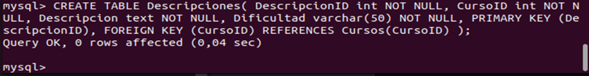
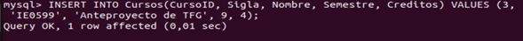
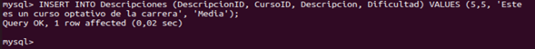
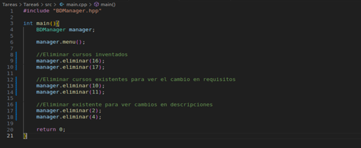

# Tarea 6
-  Curso IE0217
- Profesor Esteban Badilla
- Santiago Herra Castro C13721

### Ejecucion del programa 
Primero asegurese de estar en la carpeta **src**. Despues en la terminal shell ingrese el comando.
```
g++ -o ejecutable.exe main.cpp BDManager.cpp -lmysqlcppconn 
```
Esto le compilara el archivos para crearle el ejecutable **ejecutable.exe**. Para ejecutar el programa ingrese el comando.
```
./ejecutable.exe
```

### Parte teorica.

1. **¿Qué es una base de datos relacional y cuáles son sus características fundamentales?**
    Una bases de datos relacional es un conjunto de informacion ordenadsa relacionada con diferentes conjuntos de informacion. Este modelo de esta basado en tablas unidas nos con otras segun un modelo relacional.

2. **¿Cuál es la diferencia entre una clave primaria y una clave candidata en una base de datos relacional?**
    Una llave primaria es un identificador que pose una tabla la cual es unica por unidad de informacion en la tabla, esta tabla puede tener multiples claves las cuales poseen un tipo de informacion para la tabla pero solo una de estas puede ser la clave primaria.

3. **¿Qué son las claves foráneas y cómo se utilizan para mantener la integridad referencial en una base de datos?**
    Las claves foraneas son identificadores dentro de una tabla de datos que tambien son la clave primarias para otra tabla de datos dentro de una misma base de datos relacional. La llave foranea mantiene orden y registro mediante el vinculo entre las tablas haciendo que no se tenga perdida de datos de manera repentina.

4. **¿Qué es una transacción en el contexto de bases de datos y cuáles son las propiedades ACID que debe cumplir?**
    Una transaccion es la operacion que manipula la informacion dentro de la base de datos. Las propiedades ACID son son integrales para las transacciones. ACID significa Atomicidad, COnsistencia, Isolacion y Durabilidad.


5. **¿Qué son las vistas (views) en SQL y cuáles son los beneficios y limitaciones de su uso?**
    Las visitas son el resultado de una busqueda en la base de datos, los beneficios de estas vistas es la simplicidad de busqueda de informacion, la seguridad, consistencia e independencia de informacion. Algunas limitaciones son el rendimiento en casos de alto uso, no son actualizables a cambios y poseen dependencias. 

6. **¿Qué es la normalización en bases de datos y cuáles son las diferentes formas normales (normal forms)?**
    La normalizacoin es un proceso de organizar la base de datos para reducir la redundancia y mejorar la integridad de la tabla. Las formas de normalizar las tablas son:
    1. Propiciar la atomicidad en cada valor y en cada columna.
    2. Asegurarse que cada valor sea dependiente de la clave primaria excepto las claves foraneas.

7. **¿Cómo funcionan los índices en SQL y cuál es su impacto en el rendimiento de las consultas?**
    Los indices son tablas especiales las cuales sirven para poder realizar vistas dentro de la base de datos. Los indices mejoran el rendimiento de la busqueda, rendimiento de operaciones y el espacio disponible. 
8. **¿Qué es SQL Injection y cuáles son las mejores prácticas para prevenir este tipo de ataque?**
    La inyeccion de SQL es una tipo de ataque al codigo de la base de datos la cual perjudica la seguridad de la informacion en la tabla de datos. Esto se realiza mediante la inyeccion de codigo maligno que corrompe la base de datos. La mejor manera de prevenir estos ataques es tratar el ingreso de informacion del usuario como informacion y no como comandos.

9. **¿Qué son los procedimientos almacenados (stored procedures) en SQL y cómo pueden mejorar la eficiencia y seguridad de las operaciones de base de datos?**
    LOs procedimientos almacenados en SQL son procedimientos que son precompilados dentro de la base de datos SQL. Estos pueden mejorar la efiencia de manera en que multiples procedimeintos pueden ser ejecutados al mismo tiempo haciendo que el rendimiento mejore. La seguridad puede mejorar debido que se restringe el acceso directo a la informacion. 

10. **¿Cómo se implementan las relaciones uno a uno, uno a muchos y muchos a muchos en una base de datos relacional y qué consideraciones se deben tener en cuenta en cada caso?**
    Las implementaciones 1 a 1, se realizan mediante la clave primaria que hace referencia a una sola llave primaria de otra tabla de datos, se debe de tomar en consideracion que cada valor este vinculado a uno solo por tabla. La implementacion uno a muchos, es cuando un valor de informacion esta unido multiples en otra tabla de datos, siendo la primera la padre y la segunda el hijo. La implementacion muchos a muchos, se le dice tabla puente y hace referencia a una tabla de datos unida a otra tabla de datos de manera multiple.

## Parte Documentacion

Aqui se mostrara la documentacion de la parte practica de la tarea #6. La tarea se realizo mediante el motor de bases de datos MySql en el sistema operativo Linux Ubuntu. Las operaciones fueron realizadas en la terminal de MySql. 

**Nota**

Las imagenes del markdown estan adjuntas en el repositorio en orden por si desea ver de otra manera.

### Creacion de bases de dato y tablas
Comenzando se creo la base de datos "eie", en donde se tendran las tablas Cursos, Descripciones y Requerimientos.

Se utilizo el comando
```
CREATE DATABASE eie;
```


Seguidamente se crearon las tablas de datos Cursos, Descripciones y Requerimientos. Al inicio se configuro la columna "Sigla" como de tipo INT NOT NULL UNIQUE pero se cambio debido que los cursos de tipo **optativo** poseen la misma sigla hasta que se cambie por un curso en especifico. 

**Creacion de tabla Cursos**


**Creacion de tabla Descripciones**



**Creacion de tabla Requerimientos**


Ahora con las tablas configuradas de manera correcta, se ingresan los valores de uso en las tablas, se ingresaron los cursos de licenciatura para la carrera de Ingenieria Electrica enfasis en Redes y Computadoras.

**Ingresar valores en Cursos**





Despues de ingresar los cursos de licenciatura se puede visualizar la tabla de datos de Cursos con el comando:
```
SELECT * FROM Cursos;
```


Seguidamente, se ingresaron los cursos de bachillerato que los requerimientos de los cursos de licenciatura.


Se obtuvo la tabla de datos con el comando:
```
SELECT * FROM Cursos;
```


**Ingresar valores en Requerimientos**
Ahora se ingresan los valores para la tabla de Requerimientos


Se puede visualizar el cambio en la tabla de Requerimientos:


**Ingresar valores en Descripciones**

Ahora se ingresaron los valoes en la tabla de Descripciones:





Se puede visualizar el cambio en la tabla de Descripciones:


### Operaciones CRUD

Las operaciones CRUD se realizaron en C++, se creo la clase BDManager donde se crearon metodos para poder realizar las operaciones requeridas. Se debe de tomar en cuenta que los comandos de SQL QUERY estan en los metodos utilizados en la clase BDManager. 

**Crear**
Se utilizo el siguiente codigo:


Antes de realizar ejecutar el comando se puede el estado de la tabla de cursos:


Ahora se puede ver el cambio en la base de datos:


Y ademas se puede visualizar como se agregaron las descripciones en la tabla Descripciones.


**Leer**

Para realizar las operaciones de leer se utilizo el siguiente codigo:


Se obtuvo la siguiente salida para cuando se desea leer todos los cursos de la base de datos.


Cuando se quiere ver un curso en especifico, se implemento que la busqueda del curso fueron con el ID de curso:


Cuando se desea ignorar los cursos optativos se realizo la busqueda con la sigla 'IE'. Se puede ver el resultado en la siguiente imagen:


**Actualizar**

Para la actualizacion se utilizo el siguiente codigo:


Se tiene que la tabla de cursos antes de la modificacion fue la siguiente:


Despues del cambio se tiene la siguiente tabla de Cursos:


Ahora antes de realizar los cambios en tabla de Descripciones, esta de la siguiente manera.


Y despues de los cambios se tiene la siguiente tabla de descripciones.


**Eliminar**

Se utilizo el siguiente codigo para la implementacion de las eliminaciones:



Antes de ejecutar la eliminacion se tiene la tabla de cursos:


Y despues de la operacion se tiene la tabla actualizada.


Se puede ver como en la tabla de Requisitos tambien se eliminan los cursos con requisitos porque si no existe el curso ya no tendrian.


Por ultimo se puede ver como se elimina la descripcion del curso en la siguiente figura:


